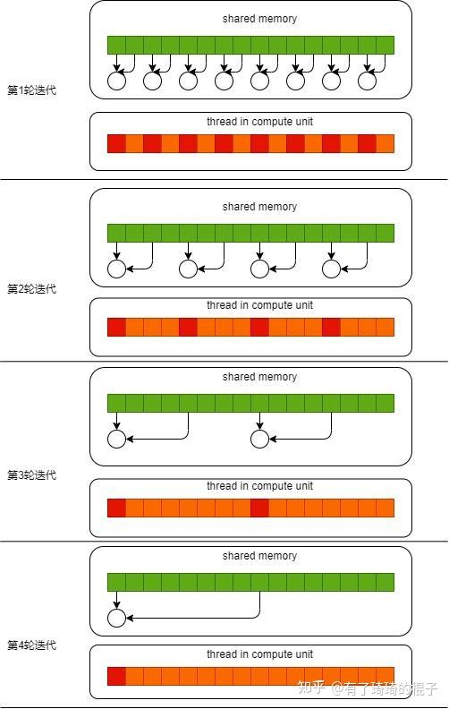

# 每种优化方法对比
## reduce_v0
利用取余操作逐渐规约"相邻"两元素值
```cpp
for(unsigned int s = 1; s < blockDim.x; s *= 2){
    if(tid % (2*s) == 0){
        sdata[tid] += sdata[tid + s];
    }
    __syncthreads();
}
```


## reduce_v1
由于v0版本会导致线程束分化，且取余操作较为耗时，因此优化
在CUDA中，线程是以线程束（warp）为单位执行的，每个线程束包含32个线程。当一个线程束中的线程执行不同代码路径时，会发生"线程束分化"，这会显著降低性能。
```cpp
for(unsigned int s = 1; s < blockDim.x; s *= 2){
    int index = 2*s*tid;
    if(index < blockDim.x){
        sdata[index] += sdata[index+s];
    }
    __syncthreads();
}
```
假设我们有8个线程:
- 方法一（更快）的执行过程
    - 可以看到这里的活跃线程是顺序的(前半部分)   
```
初始数据: [1,1,1,1,1,1,1,1]
s=1: 
  线程0: sdata[0] += sdata[1] = 2
  线程1: sdata[2] += sdata[3] = 2
  线程2: sdata[4] += sdata[5] = 2
  线程3: sdata[6] += sdata[7] = 2
  线程4-7: index超出范围，不执行
  数据变为: [2,1,2,1,2,1,2,1]

s=2:
  线程0: sdata[0] += sdata[2] = 4
  线程1: sdata[4] += sdata[6] = 4
  线程2-7: index超出范围，不执行
  数据变为: [4,1,2,1,4,1,2,1]

s=4:
  线程0: sdata[0] += sdata[4] = 8
  线程1-7: index超出范围，不执行
  数据变为: [8,1,2,1,4,1,2,1]
```

- 方法二（较慢）的执行过程
```
初始数据: [1,1,1,1,1,1,1,1]
s=1: 
  线程0: 1+1=2  线程2: 1+1=2  线程4: 1+1=2  线程6: 1+1=2
  线程1,3,5,7: 不执行
  数据变为: [2,1,2,1,2,1,2,1]

s=2:
  线程0: 2+2=4  线程4: 2+2=4
  线程1,2,3,5,6,7: 不执行
  数据变为: [4,1,2,1,4,1,2,1]

s=4:
  线程0: 4+4=8
  线程1-7: 不执行
  数据变为: [8,1,2,1,4,1,2,1]
```

## 参考引用
1. https://cuda.keter.top/optimize_reduce/unroll/
2. https://zhuanlan.zhihu.com/p/426978026